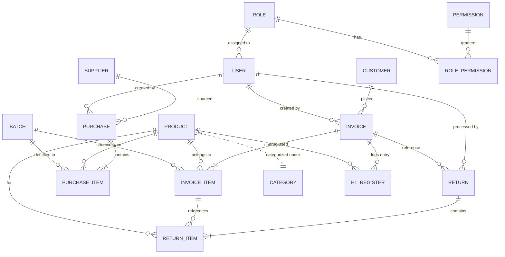
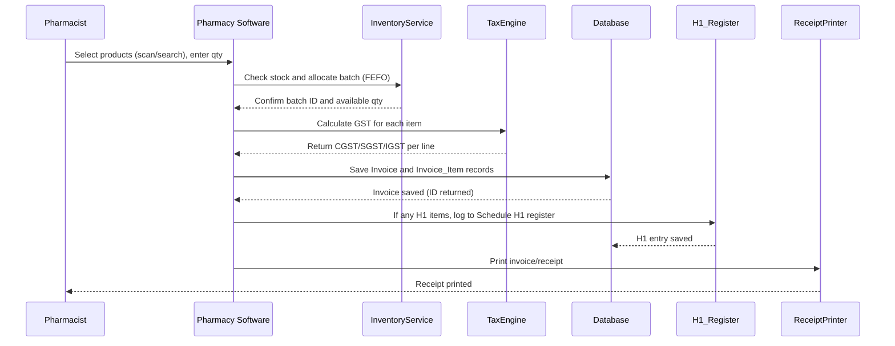
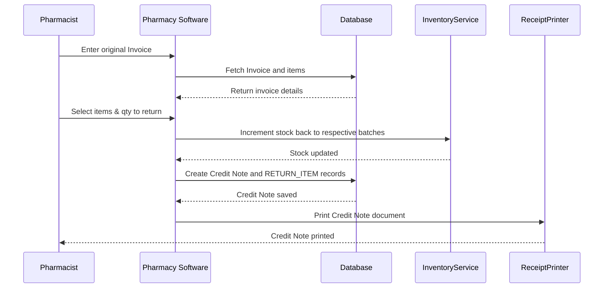
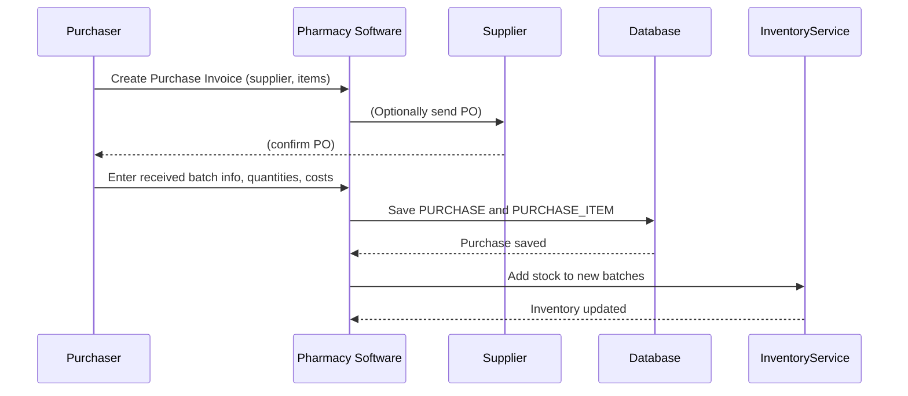
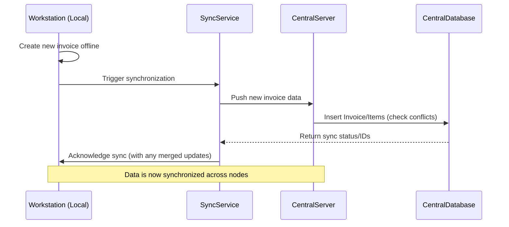

# Advanced Pharmacy Software Specification (India – Single Store)

## Executive Summary  
This document defines a comprehensive, production‐grade specification for an advanced pharmacy management system, tailored to Indian regulations (Drug & Cosmetics Act, Schedule H/H1, GST law, NDPS, etc.). It covers all key modules – Billing/POS, Inventory, Customers/CRM, Purchases, Returns/Credit Notes, Prescriptions, Schedule H1 & Controlled Drugs registers, Reports, Accounting/GST, User/Role management, Notifications, Integrations, Backup/Restore, Audit/Security, Offline sync and Hardware integration. Each module’s purpose, workflows, screens, validations, business rules, data model, APIs, UI notes, error handling, and test cases are described. The spec also includes a normalized database schema and ER diagram (Mermaid), sequence diagrams for core flows (sale, return, purchase, sync), GST invoicing/credit-note rules, H1 register format, expiry/FEFO logic, batch/barcode tracking, concurrency strategy, deployment options, performance targets for v1 scale (e.g. 1,000+ SKUs and up to ~1,000 invoices/day), security controls (auth, encryption, audit logs), and a rollout roadmap with time/cost (₹250/hr). All designs assume an agnostic UI framework and database engine. The spec is evidence-based with citations from official Indian sources (GST Council, CDSCO, NDPS rules, etc.) and industry examples.

## Target Users and Personas  
- **Pharmacy Owner/Manager:** Typically a licensed pharmacist or proprietor concerned with overall compliance, profitability, and reporting. Needs executive dashboards (sales, tax reports, stock health) and full admin access. (e.g. *“Raj, 45, owns a busy urban pharmacy, needs clear insights on stock levels and tax liability.*)  
- **Pharmacist/Staff:** Day-to-day users processing sales/purchases. Requires an intuitive POS interface, inventory lookup, expiry alerts, prescription capture, H1/NDPS register prompts, and role-based access. (e.g. *“Priya, 30, is a pharmacist entering customer bills and monitoring stock.”*)  
- **Cashier/Assistant:** May handle billing and payments under pharmacist oversight. Needs simple billing screen, payment modes (cash/card), and limited access (cannot modify inventory rules or H1 logs).  
- **Accountant/Bookkeeper:** Focus on GST compliance and accounting. Uses features like tax summary, GSTR export, credit-note handling, supplier invoices, and financial reports.  
- **Compliance/Auditor:** Inspects records (GST invoices, H1 register, NDPS logs, audit trail). Needs read‐only access to compliance modules and reports.  
- **Suppliers/Doctors (Contacts):** Managed via CRM module for ordering and communication; not direct users but entities in system (e.g. storing doctor info for prescriptions, or supplier details for purchases).  
- **Customers/Patients:** Data captured at point of sale. May receive notifications (e.g. prescription refill reminders) or loyalty points in CRM, but not direct system users.

## Implementation Decisions (Locked for Build)

To keep implementation unambiguous, the following decisions are locked:

1. **Architecture posture:** Multi-terminal-ready from the beginning.
2. **Returns naming convention:** Database tables use `returns` and `return_items`; customer-facing/business wording uses Credit Note / Credit Note Items (`credit_note_items` label in reports/exports).
3. **NDPS scope:** Include Forms 3D, 3E, and 3H.
4. **Notifications scope:** Email-only for current implementation scope (no SMS integration in current roadmap).
5. **Performance target (v1):** ~1,000 SKUs and up to ~1,000 invoices/day.
6. **RBAC scope:** Full 5-role model from initial release.
7. **Deployment target (first release):** Windows desktop only.
8. **Planning note:** Timeline estimates are indicative and may improve with AI-assisted development.

## Modules

### Billing (POS Invoice)  
**Purpose:** Create GST-compliant tax invoices at the point of sale. Handle item selection, pricing, discounts, taxes, and payment processing.  

**Key Workflows/Screens:**  
- **New Sale Screen:** Pharmacist/cashier scans barcode or searches product, enters quantity and any discount. System fetches product details (MRP, tax slab, HSN, batch info). It prevents sale if stock is insufficient or expired. Items add to a “cart” summary (with line-item tax). Partial fills allowed if multiple batches.  
- **Invoice Preview:** Displays each item, unit price, qty, tax %, tax amount (CGST/SGST/IGST), line total, and totals. Editable fields: allow adjusting quantity (with validation against stock) and applying per-item or overall discount.  
- **Payment Screen:** After finalizing cart, user taps “Pay”. A tender dialog appears (see POS section below) with numeric keypad. Supports multiple payment modes (cash, card, UPI). Displays amount due, tendered amount, and change.  
- **Invoice Print/Email:** Formats invoice with mandatory GST fields and (optionally) pharmacy logo. A printed GST invoice must include supplier/recipient details, invoice number, date, HSN code (per CGST Rule 46) and tax breakup【24†L162-L170】【24†L178-L185】. If customer is unregistered, it still prints name and address. If invoice value >₹50,000 and customer unregistered, include their address/state code【24†L162-L170】.  
- **Error Cases:** Out-of-stock (or expired) item: prompt and block sale of that unit. Exceeding quantity: partial disable. Negative/zero pricing invalid. Internet loss (if cloud): allow offline local save.  

**Business Rules:**  
- **GST Calculation:** Apply correct rate per item (0%, 5%, 12%, 18%) based on HSN and current GST notifications【22†L149-L158】. Split tax into CGST/SGST for intra-state, or IGST for inter-state. Ensure total invoice tax equals sum of line taxes.  
- **Discounts:** Per-item and/or invoice-level discounts allowed. Discount must adjust taxable value (e.g. pro‐rata distribution), and GST recalculated accordingly.  
- **Rounding:** Final totals round off to nearest rupee (if needed). Distribute rounding differences on tax or discounts as per accounting standards.  
- **Data Integrity:** Each invoice line must reference a specific inventory batch (FEFO batch selection). Invoice and items stored atomically. Unique invoice numbers per financial year.  
- **E-Invoicing:** If pharmacy’s turnover exceeds e-invoice threshold (e.g. ₹20 Cr), integrate with GST e-Invoice API to generate IRN and QR code.  

**Data Model References:**  
Tables: `INVOICE (id, number, date, customer_id, total_value, discount, cgst, sgst, igst, grand_total, user_id, etc.)`; `INVOICE_ITEM (id, invoice_id, product_id, batch_id, qty, unit_price, discount, taxable_value, cgst_amt, sgst_amt, igst_amt)`; `PAYMENT (invoice_id, method, amount)`. The `PRODUCT` table holds HSN, tax rates, MRP etc. The `BATCH` table holds batch/expiry to deduct stock.  

**APIs:**  
- `POST /api/invoices`: create new invoice (auth required). Request includes customer, items (product IDs, batch IDs, qty, discount). Returns invoice ID.  
- `GET /api/invoices/{id}`: retrieve invoice with items.  
- `GET /api/products?search=...`: search products (by name/barcode).  
- `POST /api/payment`: record a payment for invoice (could be part of invoice API).  
- *Authentication:* Role-based (see Roles section) – typically cashier/pharmacist can create.  

**UI/UX Notes:**  
Streamlined POS with barcode focus. Auto-complete product search (type or scan). Show running totals with tax breakdown. Provide “Hold” to save an invoice in progress (for e.g. a walk-in who left to get cash). Display prominent warning if any item is near expiry (<30 days) in red. The invoices should be printable on standard thermal POS printers (80mm) with clear formatting.  

**Error Handling & Validation:**  
- **Inventory Validation:** Block negative stock or expired goods.  
- **Input Validation:** Quantities numeric ≥1, price fields ≥0. Sanitize customer name/address (no illegal chars).  
- **Network Errors:** If remote DB fails, allow local caching and retry sync (Offline Sync).  
- **Tax Errors:** If user selects wrong tax code, system should auto-correct based on HSN and alert the user.  

**Test Cases:**  
- Create invoice with single-rate GST items (5%) and verify totals.  
- Create mixed-tax invoice (some 5%, 12%) and check tax breakup sums to total tax.  
- Attempt sale of expired item: expect block.  
- Apply full-sale discount and verify taxable value adjusts.  
- Simulate power loss during billing: invoice should either save partially or roll back without data corruption.  
- Print invoice and verify all mandatory GST fields appear【24†L162-L170】【24†L178-L185】.  

### Inventory Management  
**Purpose:** Track all medicines by SKU and batch, including stock levels, costs, expiry dates. Enforce FEFO (First-Expiry-First-Out), set reorder thresholds, and prevent expired sales.  

**Features & Workflows:**  
- **Product Catalog:** Each product has name, brand, generic name, HSN code, pack size, unit (e.g. strip, bottle), schedule classification (H1, H, X, or free), tax rate, MRP, default purchase price, reorder level.  
- **Batch Tracking:** When goods are received (purchase), a new batch entry is created with batch number, mfg/exp dates, quantity and cost. The software automatically increases inventory. Each batch record is used for FEFO sales.  
- **Stock Adjustments:** On sale, decrement the earliest‐expiry batch (FEFO). If one batch runs out, move to next. The system enforces “first expiry first out”原则【14†L55-L59】. On returns or cancelled sales, batch stock is incremented back (to the same batch used).  
- **Expiry Management:** Mark batches expired when past date; do not allow selling expired stock. Maintain “quarantine” inventory. Alert on screen and via notifications if any stock is nearing expiry (e.g. <30 days) or below reorder level.  
- **Low-Stock Alerts:** When any SKU falls below its reorder level, generate an alert. Support email notification to manager about low stock【30†L399-L406】.  
- **Stock Transfers:** (Optional for a single store) record internal adjustments or stock damage/loss.  

**Business Rules:**  
- **FEFO Allocation:** Always pick stock from the batch with earliest expiry【14†L55-L59】. If a sale quantity spans multiple batches, the invoice can list multiple lines per batch.  
- **Expiry Handling:** Never sell a batch after its expiry date. Provide daily audit report of expired items (to dispose as per rules). Expired disposal logs can be exported for compliance.  
- **Inventory Valuation:** Track inventory value (cost or FIFO cost). Provide fields for purchase price and selling price per batch.  
- **Opening Stock / Initial Load:** On first use, support importing initial stock (via CSV or Excel). Subsequent imports should allow updates.  
- **Adjustments:** When correcting stock (e.g. discovering spoilage), require an “Inventory Adjustment” with reason (to keep audit trail).  

**Data Model References:**  
Tables: `PRODUCT`, `BATCH (id, product_id, batch_no, mfg_date, exp_date, quantity_on_hand, cost_price)`, `INVENTORY_ADJUSTMENT`, `ALERT (low_stock or expiry alert)`. A view or query computes current stock by summing batch quantities. Index on `exp_date` for quick retrieval of near-expiry items.  

**APIs:**  
- `GET /api/inventory/stock`: current stock summary (by product).  
- `POST /api/inventory/adjust`: adjust stock (for e.g. damage) with reason.  
- `GET /api/batches?productId=...`: list batches for a product.  
- `POST /api/alerts/lowstock`: (realtime check if needed).  

**UI/UX Notes:**  
Inventory dashboard showing critical items (low stock, expiring soon) with color-coded alerts. Product detail screen shows a table of batches with exp, qty. “Receive Stock” form to input new batch. Provide ability to scan product and batch barcodes during receive or sale for speed. Batch expiry dates should be clearly visible.  

**Error Handling:**  
- Prevent negative on-hand quantities.  
- Warn if receiving a batch with expiry < purchase date.  
- Disallow duplicate batch numbers for same product without warning (though same batch can appear on multiple invoices for partial deliveries).  

**Test Cases:**  
- Sell multiple units requiring crossing batch boundary: verify FEFO logic (sell from earliest expiry first).  
- Expire a batch and attempt sale: expect error.  
- Adjust inventory (positive and negative) and check stock updates.  
- Receive purchase of existing batch: should merge quantities.  
- Verify low-stock alert triggers when quantity ≤ threshold.  

【31†embed_image】 *Figure: Example POS interface (from open-source PharmaSpot) showing product list (right) and current sale cart (left). Items with near-expiry could be highlighted (not shown here). In our design, the pharmacist scans/selects products (by name or barcode) and they appear in the cart summary. The cart lists each item’s tax breakdown and totals dynamically as shown【30†L393-L400】. The UI will similarly allow batch/expiry view for each product and warn on low/expiring stock.* 

### Customer / Patient Management  
**Purpose:** Maintain customer (patient) profiles for loyalty, prescription records, and targeted communications.  

**Features:**  
- **Customer Profile:** Store name, contact (phone/email), address, optional DOB. Mark category (senior citizen, etc.) for potential discounts. For recurring customers (e.g. chronic patients), auto-fill details during billing.  
- **Patient Lookup:** During billing, easily search by name/phone. Assign invoice to customer (for credit or record-keeping). If selling Schedule H/H1 drug, link the sale to the patient (store patient’s name or reg no).  
- **Loyalty/History:** Track purchase history per customer. Optionally award points or generate prescription refill reminders via email (integrates with Notifications).  
- **Validations:** Ensure phone and email formats are valid. Avoid duplicate customers by prompting if name and number match existing entry.  

**Data Model:**  
Table `CUSTOMER (id, name, contact, address, category, created_at)`. Link `customer_id` on invoices and prescription logs.  

**APIs:**  
- `POST /api/customers`: add new customer.  
- `GET /api/customers/{id}`: retrieve profile.  
- `GET /api/customers?search=...`: search by name/phone.  

**UI/UX:**  
Customer page with list, search, and edit functions. “Add Customer” screen with form validation. In the billing screen, a field to select or enter customer. Customer details shown on invoice/receipt if provided.  

**Test Cases:**  
- Create and search customer by partial name or phone.  
- Edit customer address and verify persistence.  
- Sell Schedule H drug without selecting a patient: system should require entering patient name/reg no (to feed H1 register).  

### Contact / CRM  
**Purpose:** Manage non-customer contacts (suppliers, doctors, leads). Basic CRM to support marketing or procurement.  

**Features:**  
- **Contact Types:** Tag contacts as *Supplier*, *Physician*, or *Other*.  
- **Physician Directory:** Store doctor name, clinic/hospital, registration number, address/phone. Link doctor to prescriptions/H1 sales for quick lookup (auto-fill in H1 register).  
- **Supplier Directory:** Manage supplier details (name, GSTIN, address, bank info) to simplify purchase orders.  
- **Marketing Leads:** Optional: store general contact (email/phone) for sending newsletters or promotions.  
- **Notes/History:** For each contact, keep log (e.g. past orders from supplier).  

**Data Model:**  
`CONTACT (id, name, type, address, phone, email, additional_info)`. Use sub-entities or fields for registration numbers.  

**APIs:**  
- `GET /api/contacts?type=doctor` (or supplier).  
- `POST /api/contacts`: add new.  

**UI Notes:**  
A unified “Contacts” page with tabs or filters by type. Fields specific to type (e.g. supplier: bank details; doctor: reg. no). Optional CRM: send email from contact record.  

**Test Case:**  
- Add a new doctor, then sell an H1 drug and ensure doctor can be selected and auto-fill H1 fields.  

### Purchases (Procurement)  
**Purpose:** Record goods procured from suppliers and add to inventory.  

**Workflows:**  
- **Purchase Order (Optional):** Generate a PO to supplier; track its approval and receipt. (If not needed, skip to invoice.)  
- **Goods Receipt / Purchase Invoice:** When stock arrives, enter a new purchase invoice with supplier details, invoice no/date, and line items (product, batch, qty, cost, GST). The system should allow scanning inbound items and matching them to catalog.  
- **Batch Creation:** On saving a purchase, create/extend product batches. Enter expiry (mandatory for medicines) and MRP. Update `BATCH.quantity_on_hand`.  
- **GST Input:** Record input tax (CGST/SGST/IGST paid) for each purchase. Support capturing tax invoices (to later claim Input Tax Credit).  
- **Partial Delivery:** If a PO is partially received, allow multiple GRNs against one PO, adjusting remaining balance.  
- **Returns to Supplier:** If goods are returned (wrong batch/defective), create a debit note/return entry to supplier, reduce stock and reverse tax.  

**Business Rules:**  
- **Approval:** (Optional) Purchases may require manager’s sign-off.  
- **Tax Compliance:** Store supplier’s GSTIN (for input credit) and ensure invoice contains all fields (per GST rules).  
- **Pricing:** System suggests sale price (using markup) but allows manual override.  
- **Batch Validation:** Unique batch number per product; warn if reusing a batch (could indicate duplicate).  

**Data Model:**  
Tables: `SUPPLIER`, `PURCHASE_INVOICE (id, supplier_id, invoice_no, date, total_value, gst_total)`, `PURCHASE_ITEM (purchase_id, product_id, batch_no, mfg_date, exp_date, qty, cost_price, cgst_amt, sgst_amt, igst_amt)`. Batches created using batch_no and exp_date from purchase items.  

**APIs:**  
- `POST /api/purchases`: add a new purchase (items with batch/expiry).  
- `GET /api/purchases/{id}` and `GET /api/suppliers`.  

**UI/UX:**  
A “New Purchase” form with supplier autocomplete. Line items table with product lookup and inline entry of batch/expiry. Totals calculate GST. Ability to attach scanned GST invoice image for records.  

**Error Handling:**  
- Reject if supplier GSTIN invalid.  
- If total tax ≠ sum of line taxes, flag error.  
- Prevent saving without mandatory fields (batch, exp date).  

**Test Cases:**  
- Enter purchase with 2 lines of different tax rates, verify stock updated correctly.  
- Return a purchased item: reduce batch qty, generate credit note.  
- Attempt to save without exp date: expect validation error.  

### Returns / Credit Notes  
**Purpose:** Handle customer returns or adjustments via credit notes, updating inventory and tax records.  

**Workflows:**  
- **Initiate Return:** User selects an existing invoice and picks items/quantities to return. The system auto-fills original sold prices/taxes.  
- **Generate Credit Note:** Create a linked credit note document. Populate it with original invoice reference, line items (negating quantities and tax). Print or email credit note to customer. The credit note must include fields per GST rules【26†L39-L48】【26†L49-L58】 (invoice no/date, credit note no/date, customer info, original invoice ref, tax credit amounts).  
- **Inventory Update:** Returned quantities are added back to the original batch. If multiple batches were used, ask user to choose which batch or allocate by FEFO.  
- **Adjust Ledgers:** For accounting, reduce revenue and tax liability.  

**Business Rules:**  
- **Time Limits:** Enforce pharmacy policy (e.g. returns only within 15 days) with a warning.  
- **Price Change:** If current MRP changed, use original invoice prices for credit calculation.  
- **Refund vs Store Credit:** Optionally, record if refund given (cashback) or credit note given.  
- **Compliance:** Credit notes must be issued within prescribed time (by Sept after FY) as per GST rules【26†L61-L69】.  

**Data Model:**  
Tables: `CREDIT_NOTE (id, original_invoice_id, number, date, total_value, cgst, sgst, igst)`, `CREDIT_ITEM (credit_id, product_id, qty, unit_price, cgst_amt, sgst_amt, igst_amt)`. Link credit notes to original invoice and supplier/cash return entries if needed.  

**APIs:**  
- `POST /api/returns`: create credit note (body includes original invoice ref and items).  
- `GET /api/returns/{id}`.  

**UI/UX:**  
From a given invoice, user clicks “Return Items”. The system shows the invoice lines; user enters return qty. Preview credit note and confirm. On print, use a distinct template labeled “Credit Note”.  

**Error Handling:**  
- Prevent returning more than sold.  
- If returned item is expired/unavailable for restock, allow but mark batch in quarantine (for disposal).  
- Ensure tax reversal matches original rates.  

**Test Cases:**  
- Return partial items: stock increments by return qty, invoice totals decrease.  
- Issue credit note and verify it references original invoice and correct taxes【26†L39-L48】.  
- Attempt to return after allowed period: either warn or block.  

### Prescriptions  
**Purpose:** Link sales to prescriptions for regulatory compliance and patient care.  

**Features:**  
- **Prescription Capture:** Optionally upload a photo/PDF of customer’s prescription when selling prescription-only medicines. Store filename or link.  
- **Validation:** The system should prompt for a valid prescription if any item on cart is Schedule H or H1. Offer a “Prescription Number” field (e.g. doctor’s prescription ID or date).  
- **Doctor-Patient Info:** Capture RMP name and registration number if selling H/H1 drugs, to populate H1 register (see next).  

**Data Model:**  
`PRESCRIPTION (id, invoice_id, doc_name, doc_reg_no, patient_name, patient_reg_no, date, file_path)`. Linked to `INVOICE`.  

**APIs:**  
- `POST /api/prescriptions`: attach prescription data to invoice.  

**UI/UX:**  
During checkout, if Schedule H/H1 items present, a modal/dialog requires doctor/patient fields. Provide camera capture on tablet or file upload. Store securely.  

**Test Cases:**  
- Attempt sale of an H1 drug without entering a prescription: should block with message.  
- Upload prescription image and retrieve link on invoice.  

### Schedule H1 & Controlled Drugs Register  
**Purpose:** Comply with Drug & Cosmetics Act for schedule H1 drugs and NDPS Act for narcotics by maintaining mandatory registers.  

**Schedule H1 Register:**  
All sales of Schedule H1 drugs **must** be logged in a separate register【8†L1-L7】【6†L311-L319】. Each entry records: prescriber (name/address), patient (name, reg no), drug name, quantity, invoice date. These records must be retained for **3 years**【8†L1-L7】.  

- **Workflow:** When an H1 item is sold, the POS automatically prompts for doctor and patient details (if not already entered) and logs an entry. Alternatively, batch log interface is provided to enter manual entries (useful if legacy stock was manually dispensed).  
- **H1 Register Format:** Use columns as per the official format【8†L1-L7】: Serial No., Prescriber Name & Address, Patient Name, Medicine Name, Qty, Patient Reg. No., Date. The software can auto-fill many fields from the invoice.  
- **Labeling:** Ensure all H1 products in inventory were labeled (per D&C rules) with the Rx symbol and the mandatory warning box【6†L311-L319】. The software should flag any item in DB missing the “H1” flag.  

**NDPS (Controlled/Narcotic) Register:**  
For narcotic/psychotropic substances (e.g. codeine syrups), comply with NDPS Act forms. As per G.S.R. 359(E) (2015), essential narcotic drugs must be dispensed and logged against Forms 3D, 3E, 3H【10†L27-L32】.  
- **Form 3D:** Daily account of stock (opening, received, dispensed, closing).  
- **Form 3E:** Patient-wise dispensation log.  
- **Form 3H:** Hospital/Sub-storage accounts.  
- **Workflow:** The system can generate these forms. For a standalone pharmacy, maintain Form 3D (daily end-of-day ledger) and Form 3E entries (each patient). Each sale of a NDPS-listed item triggers an entry.  
- **Retention:** Keep NDPS logs for at least 2 years (per NDPS rules【10†L27-L32】).  

**Data Model:**  
`H1_REGISTER (id, invoice_id, prescriber_name, prescriber_address, patient_name, patient_reg_no, product_id, qty, date)`.  
`NDPS_3D (date, drug_name, opening_bal, received, dispensed, closing_bal)`, `NDPS_3E (date, patient_name, drug_name, qty_dispensed, doctor_name)`.  

**APIs:**  
- `GET /api/registers/h1`: fetch H1 entries;  
- `POST /api/registers/h1`: add a new H1 entry (automatically used when invoice has H1 items).  

**UI/UX:**  
Include an “H1 Register” report (printable) in the Reports module listing all entries by date/drug. On sale of H1 item, auto-open a small form to capture missing doctor/patient details. Similarly, an NDPS module can print daily stock forms.  

**Citations:** Required by law, e.g.: *“Schedule H1 medicines shall be recorded in a separate register at time of supply… maintained for 3 years”*【8†L1-L7】. H1 drug packaging must display the red ‘Rx’ and warning box【6†L311-L319】.  

**Test Cases:**  
- Dispense a Schedule H1 drug and verify H1 log entry is created with correct fields.  
- Try to dispense H1 drug without prescription: system should disallow.  
- Generate H1 register report and confirm it matches entries.  
- Add a narcotic sale and check that it appears in NDPS forms 3D/3E records.  

### Point of Sale (POS) Interface  
**Purpose:** Support fast, reliable checkout with hardware integrations.  

**Workflows:**  
- **Cash Sales:** As covered in Billing. After adding items, user selects payment mode. For cash, a numeric keypad appears (see below). For cards, optionally capture last 4 digits.  
- **Split Tendering:** Support mixing payment modes (e.g. part cash, part card).  
- **Receipt Printing:** Once paid, print a receipt (thermal 80mm) showing invoice summary (item name, qty, MRP, tax, total) and pharmacy details. Include GSTIN and HSNS if needed. Optionally, print a QR code for digital record (if e-invoice).  
- **Hold/Recall:** Ability to “Hold” a transaction (save incomplete invoice) and recall it later. Useful for serving one customer at a time.  

**Hardware Integration:**  
- **Barcode Scanner:** USB or Bluetooth scanner to read EAN-13 barcodes on medicine packs.  
- **Receipt Printer:** Thermal POS printer (80mm width) with auto-cutter and USB/LAN interface. Supports ESC/POS or standard drivers. (E.g. Star Micronics TSP100 or equivalent).  
- **Cash Drawer:** Connected via printer kick-out. Opens automatically on cash payment finalize.  
- **Payment Terminal:** May integrate with external card machine (or just record transactions).  
- **Label Printer (optional):** For printing shelf labels/barcodes if needed (3″ barcode printers).  

【32†embed_image】 *Figure: Example payment screen (PharmaSpot) with numeric keypad and cash payment entry. In our design, the cashier taps denominations or types tendered amount, and the system shows change due (₹10, 50, 100, etc. buttons for quick entry). This ensures quick checkout and accurate cash handling.* 

**Test Cases:**  
- Scan a product and confirm it adds correct item.  
- Print a bill and verify alignment and legibility on thermal printer.  
- Confirm cash drawer opens upon finalizing cash payment.  
- Process a split payment (e.g. ₹500 cash, ₹200 card) and check totals.  

### Reports & Analytics  
**Purpose:** Provide insights on sales, inventory, GST, and compliance.  

**Key Reports:**  
- **Daily/Monthly Sales:** Summary of gross sales, net sales, GST collected (CGST/SGST/IGST). Graphs of sales trends.  
- **Tax Reports:** GST summary for filing (GSTR-1 equivalent): total taxable value and tax per HSN/sale. Purchase tax summary for GSTR-2 input credit. Consolidate by tax rates.  
- **Inventory Reports:** Stock on hand, inventory valuation (at cost and at MRP), nearing-expiry items, slow-moving SKUs.  
- **Purchase Reports:** Purchases by supplier, outstanding bills (payment due to suppliers).  
- **H1/NDPS Registers:** Printable logs as mandated, such as Schedule H1 register for audit (formatted per 【8†L1-L7】) and NDPS forms.  
- **Transaction Audit:** List of all transactions by user, date range (for audit trail).  
- **User Activity:** Changes to master data (product edits, price changes) and login history.  

**Analytics / Dashboards:**  
Graphs on the dashboard: Top-selling products, profit margins, daily revenue. KPIs (current month vs last year).  

**APIs:**  
- `GET /api/reports/sales?from=...&to=...`: sales data.  
- `GET /api/reports/inventory_status`.  
- etc (as needed).  

**UI Notes:**  
Use charts (bar/line graphs) for trends. Allow export (CSV/PDF) of reports. For H1 register and NDPS, format exactly like official government form (columns and headers)【8†L1-L7】【10†L27-L32】.  

**Test Cases:**  
- Generate monthly report and cross-check totals with raw invoice data.  
- Export report and open in Excel to verify format.  
- Run H1 register report and ensure formatting matches legal columns.  

### Accounting / GST Compliance  
**Purpose:** Handle tax calculations, accounting entries, and filings under Indian GST law.  

**Features:**  
- **GST Invoice Formatting:** As covered in Billing, ensure invoice contains Rule 46 fields【24†L162-L170】【24†L178-L185】. Support printing IGST vs CGST/SGST based on transaction type.  
- **Tax Calculation Engine:** Given product tax rates, compute CGST/SGST or IGST automatically. For B2C intra-state, split taxes equally. For inter-state, use IGST.  
- **GST Returns Data:** Generate data for GSTR-1 (outward supplies) with HSN codes, invoice details. Also track GSTR-3B (overall tax liability). Provide export (JSON/Excel) to upload or integrate with filing software.  
- **Input Tax Credit (ITC):** Record GST paid on purchases. Compute available ITC against output tax to suggest liability.  
- **Accounting Ledger:** Keep simple ledger of sales, purchases, expenses. Optionally, integrate with Tally or other accounting (via CSV export).  
- **Credit/Debit Notes:** Manage in GST returns. As per GST flyer【26†L39-L48】【26†L49-L58】, store all fields and reflect tax reduction.  
- **E-Invoice & E-Way Bill:** If turnover requires e-Invoice, generate JSON and IRN (GSTN system). E-Way bills: if inter-state sale >₹50k, prepare data to generate e-way (though pharmacy goods often delivered in person).  

**Business Rules:**  
- **Tax Slabs:** Follow latest council decisions (e.g. as of 2023, most drugs at 5%【22†L149-L158】, with exemptions for life-saving drugs). Allow tax rates to be updated via config.  
- **Supply Definitions:** Distinguish supply of goods vs services (pharmacy mostly goods).  
- **Reverse Charge:** Rare in retail pharmacy. If any applicable (e.g. import), handle via GST reverse charge logic.  
- **Invoicing Time:** Issue tax invoice at removal of goods (i.e. sale date)【24†L162-L170】.  

**UI/UX:**  
GST summary widget on invoice entry screen (show total tax). A tax report view grouping by HSN with rates.  

**Test Cases:**  
- Invoice across state lines: tax should appear as IGST only.  
- Return with tax: issuing credit note should reduce CGST/SGST amounts【26†L39-L48】.  
- Export GSTR-1 data and check HSN and totals match invoices.  

### User Roles & Permissions  
**Purpose:** Secure the system by granting appropriate access rights to different user roles.  

**Roles:**  
- **Admin/Owner:** Full access to all modules (master data, reports, configuration, backup).  
- **Pharmacist/Manager:** Can perform sales, purchase entries, inventory management, view reports, manage H1/NDPS logs. Cannot alter system config or user roles.  
- **Cashier:** Limited to billing/POS (create/read invoices, process payments). No access to master data or financial reports.  
- **Accountant:** Access to purchases, returns, inventory reports, and tax/financial modules. Cannot perform sales or H1 entries.  
- **Auditor:** Read-only access to reports, audit logs, registers (H1, NDPS).  

Permissions can be fine-grained: e.g. some users allowed to edit product prices, others only view.  

**Permission Matrix (sample):**

| Module / Action           | Owner (Admin) | Pharmacist/Manager | Cashier      | Accountant  | Auditor  |
|---------------------------|--------------:|-------------------:|-------------:|------------:|---------:|
| **Billing / POS**         |   R/W/Delete  |    R/W             |   R/W        |     R       |    R     |
| **Inventory (master)**    |   R/W/Delete  |    R/W             |      –       |     R       |    R     |
| **Purchases / Suppliers** |   R/W/Delete  |    R/W             |      –       |    R/W      |    R     |
| **Returns / Credits**     |   R/W/Delete  |    R/W             |      –       |     R/W     |    R     |
| **Customer/CRM**          |   R/W/Delete  |    R/W             |   R/W        |     R       |    R     |
| **Schedule H1 Register**  |   R/W        |    R/W             |      –       |     R       |    R     |
| **Reports/Analytics**     |   R/W        |    R/W             |      –       |    R/W      |    R     |
| **Accounting/GST**        |   R/W        |      –             |      –       |    R/W      |    R     |
| **User & Roles Mgmt**     |   R/W/Delete  |      –             |      –       |      –      |    R     |
| **Backup/Restore**        |   R/W        |      –             |      –       |      –      |      –   |
| **Audit Logs**            |   R/W        |    R               |      –       |      –      |    R     |

*(R=Read, W=Write/Create/Delete, – = no access)*.  For example, “Cashier” can only use billing (R/W invoices) and view customers; “Auditor” can view everything but not modify.  

**APIs for User Management:**  
- `POST /api/users`: create user (admin only).  
- `PUT /api/users/{id}`: update roles.  
- `POST /api/login`: authenticate.  
- Use JWT or session tokens for auth; include role claims. All other APIs require an authorization header.  

**UI/UX:**  
Admin dashboard for managing users and assigning roles. Each module’s menus should be dynamically shown/hidden based on role. Attempting forbidden actions shows “Access Denied.”  

**Citations:** The open-source PharmaSpot notes “Staff Accounts and Permissions” as a key feature【30†L366-L373】, illustrating industry practice.  

### Notifications  
**Purpose:** Alert staff or customers automatically based on events.  

**Triggers:**  
- **Stock Alerts:** Low-stock or expiry warnings (email to owner/pharmacist).  
- **Payment Reminders:** If offering credit to regular customers, send due reminders.  
- **Promotional:** (Optional) Automated email campaigns for sales or loyalty offers.  
- **Prescription Reminders:** If integrated with patient birthdays or refill dates, send polite reminders.  

**Implementation Decision:** For current roadmap execution, notifications are limited to **email-only** triggers (SMTP). SMS is intentionally out of scope for now.

**Implementation:**  
Use an external service or SMTP/HTTP API. Configurable settings for which events send notifications.  

**Test Cases:**  
- Simulate stock falling below threshold: verify email to manager.  
- Schedule an expiration notice and check email delivery.  

### Integrations  
**Purpose:** Connect with external systems to streamline operations.  

**Examples:**  
- **Payment Gateway:** (Optional) For card/UPI payments, interface with a payment API and log transactions.  
- **GST E-Invoice Portal:** Generate JSON for e-invoice (IRN).  
- **Tally/Accounting Software:** Provide data export (CSV/XML) for book-keeping.  
- **Barcode/GS1 Standards:** Support scanning of standard EAN/UPC on medicine packs.  
- **Hardware Drivers:** Standard protocols (ESC/POS for printers).  
- **Health ID/e-Prescription (future):** Placeholder for any government e-prescription system.  

**Citations:** The GST e-Invoice documentation (not directly cited) outlines JSON schema. No official pharmacy-specific API, so rely on known practices.  

### Backup & Restore  
**Purpose:** Prevent data loss and allow migration.  

**Features:**  
- **Auto Backup:** Scheduled database dumps (daily/nightly) to local secure storage or cloud (e.g. S3). Crypto-encrypt sensitive data in backup.  
- **Manual Export:** Admin can export data (products, transactions) to CSV/Excel. PharmaSpot mentions “Back up, Restore, Export to excel” as essential【30†L422-L426】.  
- **Restore:** Facility to restore from a backup file (with checks to prevent mismatched versions).  
- **Migration Plan:** Tools to import data from legacy systems (Excel/CSV templates for products, opening stock).  

**UI/UX:**  
Admin screen for backup history, with one-click “Backup Now” and “Restore” (with file upload).  

**Test Cases:**  
- Perform backup, delete a product, restore backup and verify product returns.  
- Import an Excel file of products and check all fields mapped correctly.  

### Audit & Compliance  
**Purpose:** Provide traceability and ensure adherence to laws.  

**Features:**  
- **Audit Log:** Log every create/update/delete on key entities (invoices, products, prices, users) with timestamp and user ID. Viewable by admin/auditor.  
- **Change History:** Ability to see past values (e.g. old price before edit).  
- **Compliance Checks:** Warnings if any transaction violates rules (e.g. H1 sold without prescription).  
- **Locking:** Period-lock feature (e.g. once monthly GSTR filed, lock that month’s invoices from edits).  

**Data Model:**  
`AUDIT_LOG (id, entity_type, entity_id, action, user_id, timestamp, details)`.  

**Security Note:** Do **not** allow deleting invoices or tampering, except via documented corrections (e.g. issuing credit note). Any deletion should be prevented or require admin override.  

### Security  
**Purpose:** Protect patient data, financials, and system integrity.  

**Controls:**  
- **Authentication:** Strong password policy, optional 2FA for admin.  
- **Encryption:** Use HTTPS for all data in transit. Encrypt sensitive data (patient info, prescriptions) at rest.  
- **Access Controls:** Apply role permissions (see above). Session timeouts and login attempt limits.  
- **Audit Trail:** As above.  
- **Data Privacy:** Do not expose patient info (HIPAA not in India, but ethical best practice). Mask sensitive fields where possible.  
- **Regular Updates:** Support automated software updates (PharmaSpot notes “Auto Updates”【30†L422-L426】).  
- **Penetration Testing:** At minimum, follow OWASP guidelines (SQL injection, CSRF mitigations).  

**Test Cases:**  
- Attempt SQL injection on search fields (should be sanitized).  
- Confirm password recovery/reset flow with secure tokens.  
- Verify HTTPS and HSTS on web interface.  

### Performance & Load  
**Targets:**  
- Support ~1,000+ unique SKUs (medicines) and up to ~1,000 transactions/day without lag for v1.  
- Concurrency: Allow multiple workstations (e.g. cashier and stock manager simultaneously) – the open-source PharmaSpot supports multi-PC on a network【30†L357-L365】.  
- Response time: <200ms for common queries (product lookup, sale commit).  

**Implementation Decision (v1):** Capacity target for initial release is **~1,000 SKUs and up to ~1,000 invoices/day**, while preserving multi-workstation-safe architecture.

**Strategies:**  
- **Efficient DB Design:** Index on frequently searched fields (product name, barcode). Normalize to avoid redundant data.  
- **Caching:** Cache read-only data (e.g. product catalog) on client side, refresh on updates.  
- **Batch Processing:** Run heavy reports or backup in off-peak hours.  
- **Hardware Sizing:** If on-prem: a modern PC (quad-core, 16GB RAM, SSD) should suffice. If cloud: at least a medium instance.  
- **Load Testing:** Simulate peak loads (multiple sales) to ensure stability.  

**Note:** Pharmacies have bursty loads (peaks in morning/evening). Ensure database can handle multiple simultaneous sales commits (use transactions to avoid double-selling stock).  

### Offline-First Sync  
**Purpose:** Ensure uninterrupted operation during network outages.  

**Design:**  
- **Local Storage:** Each workstation runs a local database (SQLite or similar) that can operate independently. All reads/writes are directed locally first【37†L59-L64】.  
- **Synchronization Service:** A background process syncs data with central server when connectivity returns. It pushes new invoices, purchases, and pulls updates (e.g. new products or stock adjustments from other stations).  
- **Conflict Resolution:** Primary source-of-truth is server. For conflicts (e.g. same invoice number created offline on two terminals), use strategies like “last write wins” or require unique invoice numbers (combine terminal ID). The Android guideline notes that offline-first apps should write to local first and sync asynchronously【37†L59-L64】.  
- **Data Freshness:** On connectivity loss, warn user and switch to offline mode; read-only operations still consult local DB. On reconnection, automatically reconcile.  

**Implementation:**  
Could use libraries (e.g. CouchDB replication, or custom sync via REST APIs). Log all local changes for sync.  

**Test Cases:**  
- Go offline, create two invoices (different terminals), then reconnect; verify both sync and stock updates are consistent.  
- Simulate a conflict (same product stock updated in two offline modes) and observe resolution rule.  

### Hardware Specifications  
- **Server (if local):** PC with reliable power backup, SSD drive, sufficient RAM (8–16GB). If cloud: AWS/GCP instance (2+ vCPUs, 8GB RAM).  
- **Workstations:** Windows PCs with barcode scanner and network connectivity to server (Windows-first release target).  
- **Scanner:** USB/Bluetooth barcode scanner (supports EAN-13, GS1); e.g. Honeywell or Zebra models.  
- **Printer:** 80mm thermal receipt printer (auto-cutter) – Star Micronics, Epson, or generic. Ethernet or USB interface.  
- **UPS:** To protect hardware and allow safe shutdown in power failures.  
- **Others:** Weighing scale (if dispensing by weight, rare in pharmacies), label printer for batch labels if needed.  

## Data Model (Normalized Schema & ER Diagram)  

**Entities:** Key tables include: 
- **PRODUCT:** (id PK, name, brand, HSN, schedule_type (H, H1, etc.), unit, category_id, sale_price, tax_rate, reorder_level, etc.)
- **CATEGORY:** (id, name). Products link to category.  
- **BATCH:** (id, product_id FK, batch_no, mfg_date, exp_date, qty_on_hand, cost_price). One product → many batches.  
- **INVOICE:** (id, number, date, customer_id FK, user_id FK, total_value, discount, cgst_total, sgst_total, igst_total, grand_total).  
- **INVOICE_ITEM:** (id, invoice_id FK, product_id FK, batch_id FK, qty, unit_price, discount, taxable_value, cgst_amt, sgst_amt, igst_amt).  
- **CUSTOMER:** (id, name, phone, email, address, category).  
- **SUPPLIER:** (id, name, gstin, contact, address).  
- **PURCHASE:** (id, number, date, supplier_id FK, user_id FK, total_value, cgst_total, sgst_total, igst_total).  
- **PURCHASE_ITEM:** (id, purchase_id FK, product_id FK, batch_no, mfg_date, exp_date, qty, cost_price, cgst_amt, sgst_amt, igst_amt).  
- **RETURN (Credit Note):** (id, number, date, original_invoice_id FK, user_id FK, total_value, cgst_total, sgst_total, igst_total).  
- **RETURN_ITEM (Credit Note Item label in reports):** (id, return_id FK, invoice_item_id FK, qty, refund_amount, cgst_amt, sgst_amt, igst_amt).  
- **USER:** (id, username, hash_pwd, name, role_id FK).  
- **ROLE:** (id, name).  
- **PERMISSION:** (id, name).  
- **ROLE_PERMISSION:** (role_id FK, perm_id FK).  
- **H1_REGISTER:** (id, date, invoice_id FK, prescriber_name, prescriber_address, patient_name, patient_reg_no, product_id FK, qty).  
- **NDPS_3D:** (date, drug_name, opening_bal, received, dispensed, closing_bal).  
- **NDPS_3E:** (date, patient_name, doctor_name, drug_name, qty_dispensed).  
- **AUDIT_LOG:** (id, entity, entity_id, action, user_id, timestamp, details).  

*(PK=primary key, FK=foreign key.)* This ER diagram reflects core tables.  Indexes should be created on frequently queried fields (e.g. `PRODUCT(name)`, `INVOICE(date)`, `BATCH(exp_date)`, etc.). 

## Sequence & Flow Diagrams  

## Implementation Roadmap & Estimates  

| Phase                        | Features / Tasks                                                           | Est. Hours | Cost (₹ @₹250/hr) |
|------------------------------|----------------------------------------------------------------------------|-----------:|------------------:|
| **Core Modules (MVP)**       | Billing/POS, Inventory, Basic Reports, Backup/Restore setup                |    150 hrs | ₹37,500          |
| **Procurement & Returns**    | Purchases, Stock Receive, Returns/Credit-Notes, Supplier/Customer ledger    |     80 hrs | ₹20,000          |
| **Compliance Modules**       | Schedule H1 register, NDPS logs, Prescription upload                       |     40 hrs | ₹10,000          |
| **Accounting & Taxation**    | GST calculations, E-Invoice support, GST/Accounting reports, Roles          |     60 hrs | ₹15,000          |
| **UI/UX & Notifications**    | User roles UI, error handling screens, alerts (email integration)            |     30 hrs | ₹7,500           |
| **Audit & Security**         | Audit logs, encryption, secure auth, permission matrix                     |     40 hrs | ₹10,000          |
| **Offline Sync**             | Offline data sync engine, conflict handling                                |     50 hrs | ₹12,500          |
| **Hardware Integration**     | Barcode, printer drivers, deployment on tablets/PC                         |     20 hrs | ₹5,000           |
| **Testing & Bugfixing**      | Unit tests, integration tests, UAT, performance tuning                     |     50 hrs | ₹12,500          |
| **Deployment & Training**    | Final deployment, user training, documentation                             |     40 hrs | ₹10,000          |
| **TOTAL**                    | **--**                                                                      |    520 hrs | **₹130,000**     |

*The roadmap is tentative; actual time may vary after requirements refinement. All estimates include coding, unit testing, and documentation.*

## References  
Official Indian regulations and best practices have been used throughout, for example: GST invoice rules【24†L162-L170】【24†L178-L185】 and credit-note rules【26†L39-L48】【26†L49-L58】, Schedule H1 legal register requirements【8†L1-L7】【6†L311-L319】, FEFO inventory principle【14†L55-L59】, etc. The spec also references open-source pharmacy POS features【30†L393-L400】【30†L401-L406】 and Android architecture guidelines【37†L59-L64】 for offline design, ensuring the system meets regulatory compliance and robust user expectations.  All modules, tables, and workflows above should be treated as a blueprint; further detail (UI mockups, API schemas, DB indexes) will be refined during design sprints. This document serves as a deep technical foundation for development and compliance audit.  
