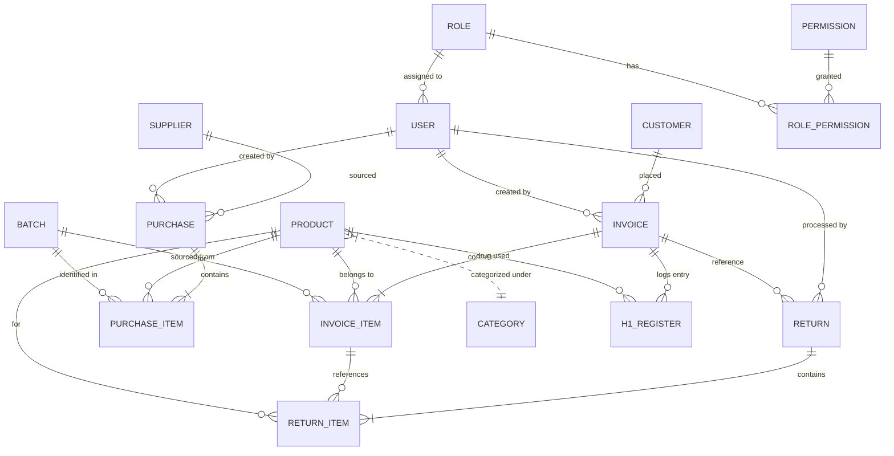

# APMS by Artific — Implementation Plan

## Overview

**APMS by Artific** is a Flutter Desktop application (Windows-first) for advanced pharmacy management, tailored to Indian regulations (GST, Schedule H/H1, NDPS, Drug & Cosmetics Act). Built with **fluent_ui** (Windows Fluent Design) + **window_manager**, using **Drift/SQLite** for local-first storage and **BLoC** for state management.

This plan translates the full 22-page specification ("Advanced Pharmacy Software Specification – India, Single Store") into a 6-phase, 8-week rollout covering 15+ modules and 20+ database tables.

---

## Technology Stack

| Layer | Technology | Version | Rationale |
|-------|-----------|---------|-----------|
| **Framework** | Flutter (Desktop) | 3.x | Cross-platform desktop, offline-first |
| **UI Kit** | `fluent_ui` | ^4.15 | Windows Fluent Design System — native look & feel |
| **Window** | `window_manager` | latest | Title bar, min size, positioning, custom chrome |
| **State Mgmt** | `flutter_bloc` | ^9.x | Event-driven, strict architecture for regulated POS/financial domain |
| **Database** | `drift` + SQLite | ^2.32 | Type-safe, reactive, local-first with `.watch()` streams |
| **Auth** | bcrypt (local) + session | — | Local user auth with hashed passwords, role-based gating |
| **PDF** | `pdf` + `printing` | latest | Invoice/receipt/report generation & print preview |
| **Thermal Print** | `unified_esc_pos_printer` | latest | ESC/POS commands for 80mm thermal printers (USB/Network/BT) |
| **Barcode Scan** | HID keyboard input | — | USB scanners act as keyboard — `RawKeyboardListener` |
| **Barcode Gen** | `barcode` | latest | EAN-13 barcode generation for labels |
| **Charts** | `fl_chart` | latest | Sales trends, dashboard analytics |
| **Email** | `mailer` (SMTP) | latest | Configurable SMTP for notifications |
| **Excel** | `excel` | latest | CSV/Excel import/export for reports & data migration |
| **DI** | `get_it` + `injectable` | latest | Service locator for repositories, services |
| **Testing** | `bloc_test`, `drift` test, `integration_test` | — | Unit + widget + integration |
| **Packaging** | `msix` | latest | Windows installer generation |

---

## Project Structure

```
artific-pharmacy-management-system/
├── docs/                              # Spec PDF, research report, this plan
├── lib/
│   ├── main.dart                      # App entry, window_manager init
│   ├── app.dart                       # FluentApp root, routing, theme
│   ├── core/
│   │   ├── theme/                     # Fluent theme tokens, dark/light mode
│   │   ├── router/                    # GoRouter or Navigator 2.0 config
│   │   ├── di/                        # get_it + injectable setup
│   │   ├── constants/                 # App-wide constants, enums
│   │   └── utils/                     # Formatters, validators, helpers
│   ├── data/
│   │   ├── database/
│   │   │   ├── app_database.dart      # Drift database class (all tables)
│   │   │   ├── tables/               # Table definitions (products, invoices…)
│   │   │   ├── daos/                  # Data Access Objects per feature
│   │   │   └── migrations/           # Schema version migrations
│   │   ├── models/                    # Data transfer objects / domain models
│   │   └── repositories/             # Repository implementations
│   ├── domain/
│   │   ├── repositories/             # Abstract repository interfaces
│   │   └── services/
│   │       ├── tax_engine.dart        # GST calculation (CGST/SGST/IGST)
│   │       ├── fefo_service.dart      # FEFO batch allocation
│   │       ├── invoice_number.dart    # Sequential invoice numbering per FY
│   │       ├── backup_service.dart    # DB backup/restore/export
│   │       ├── print_service.dart     # Thermal + PDF printing
│   │       └── email_service.dart     # SMTP notifications
│   ├── features/
│   │   ├── auth/                      # Login, session, password management
│   │   │   ├── bloc/
│   │   │   ├── pages/
│   │   │   └── widgets/
│   │   ├── dashboard/                 # KPI cards, alerts, quick actions
│   │   ├── pos/                       # Point of Sale / Billing
│   │   │   ├── bloc/                  # CartBloc, PaymentBloc, InvoiceBloc
│   │   │   ├── pages/                 # POS main screen
│   │   │   └── widgets/              # Cart, ProductSearch, NumericKeypad…
│   │   ├── inventory/                 # Products, Batches, Stock, Adjustments
│   │   ├── purchases/                 # Purchase invoices, GRN
│   │   ├── returns/                   # Customer returns, credit notes
│   │   ├── customers/                 # Customer/patient management
│   │   ├── contacts/                  # Suppliers, doctors, CRM
│   │   ├── compliance/               # H1 register, NDPS forms, prescriptions
│   │   ├── reports/                   # Sales, inventory, tax, audit reports
│   │   ├── accounting/               # GST compliance, ITC, ledger
│   │   ├── settings/                 # Users/roles, pharmacy profile, backup, email
│   │   └── shell/                    # App shell (NavigationPane sidebar, TopBar)
│   └── shared/
│       ├── widgets/                   # Reusable Fluent UI composites
│       └── extensions/               # Dart extensions
├── test/
│   ├── unit/                         # Service & BLoC tests
│   ├── widget/                       # Widget tests
│   └── integration/                  # Full flow tests
├── assets/                           # Icons, fonts, images
├── pubspec.yaml
├── analysis_options.yaml
├── AGENTS.md                         # AI agent coding guidelines
└── README.md
```

---

## Database Schema (Drift/SQLite)

All 20+ tables from the specification, implemented as Drift table classes.

**Design decisions:**
- Integer autoincrement PKs (SQLite-native, fast)
- Real type for monetary fields with 2-decimal rounding in Dart
- Soft deletes on invoices (never truly deleted per compliance rules)
- Audit logging via DAO interceptor
- Indexes on: `product(name)`, `product(barcode)`, `invoice(date)`, `batch(exp_date)`

### Tables

| Group | Tables |
|-------|--------|
| **Catalog** | `categories`, `products`, `batches` |
| **Sales** | `invoices`, `invoice_items`, `payments` |
| **Procurement** | `suppliers`, `purchases`, `purchase_items` |
| **Returns** | `returns` (credit notes), `return_items` |
| **Customers** | `customers`, `contacts` |
| **Compliance** | `prescriptions`, `h1_register`, `ndps_3d`, `ndps_3e` |
| **Auth** | `users`, `roles`, `permissions`, `role_permissions` |
| **System** | `audit_logs`, `inventory_adjustments`, `notifications`, `pharmacy_settings` |

### ER Diagram



---

## Phase 1: Foundation + MVP Core (Weeks 1–3)

The minimum viable product — a pharmacy can use this for daily billing.

### 1A — Project Scaffold
- **[NEW]** Flutter project with all core dependencies
- **[NEW]** `main.dart` — `window_manager` init (min 1024×768, custom title bar, centered on screen)
- **[NEW]** `app.dart` — `FluentApp` with dark/light theme toggle, `NavigationPane` shell
- **[NEW]** `core/theme/` — Fluent design tokens (accent color, typography, spacing)
- **[NEW]** `core/router/` — Route definitions with auth guard middleware
- **[NEW]** `core/di/` — `get_it` + `injectable` dependency injection setup

### 1B — Database Layer
- **[NEW]** `data/database/app_database.dart` — Full Drift database with all 20+ tables
- **[NEW]** `data/database/tables/` — All Drift table class definitions
- **[NEW]** `data/database/daos/` — DAOs: `ProductDao`, `InvoiceDao`, `BatchDao`, `UserDao`, etc.
- **[NEW]** Seed logic — default roles (Admin, Pharmacist, Cashier, Accountant, Auditor), default admin user

### 1C — Authentication
- **[NEW]** `features/auth/` — Login page with Fluent UI, `AuthBloc`, bcrypt password hashing
- **[NEW]** Permission matrix (spec's 5-role × 11-module table) as Dart constants
- **[NEW]** `NavigationPane` items dynamically show/hide based on logged-in user's role

### 1D — POS / Billing
- **[NEW]** `features/pos/` — Full POS screen:
  - Product search (text autocomplete + barcode HID input via `RawKeyboardListener`)
  - Cart with live tax breakdown (CGST/SGST/IGST per line item)
  - FEFO batch auto-allocation (earliest expiry first)
  - Per-item and invoice-level discounts with GST recalculation
  - Payment dialog (numeric keypad, cash/card/UPI modes, split tendering)
  - Hold/recall incomplete transactions
  - Schedule H/H1 drug detection → prescription prompt modal
- **[NEW]** `domain/services/tax_engine.dart` — GST calculation engine (0/5/12/18%), intra-state CGST+SGST vs inter-state IGST
- **[NEW]** `domain/services/fefo_service.dart` — Earliest-expiry-first batch allocation with multi-batch spanning
- **[NEW]** `domain/services/invoice_number.dart` — Sequential numbering per financial year (Apr–Mar)

### 1E — Inventory Management
- **[NEW]** `features/inventory/` — Product catalog CRUD, batch tracking, stock dashboard
  - Color-coded alerts (low stock = amber, expiring soon = red, expired = dark red)
  - Stock adjustment form with mandatory reason (audit trail)
  - CSV import for initial product load
  - Batch detail view with expiry dates and quantities

### 1F — Dashboard
- **[NEW]** `features/dashboard/` — KPI cards (today's sales, active alerts), quick-access tiles, near-expiry/low-stock widgets

---

## Phase 2: Procurement & Returns (Week 4)

- **[NEW]** `features/purchases/` — Purchase invoice entry, supplier autocomplete, auto-batch creation on save, GST input tax recording for ITC
- **[NEW]** `features/returns/` — Return workflow (select original invoice → pick items/qty → generate credit note), FEFO-aware re-stocking, configurable time limit (default 15 days), tax reversal
- **[NEW]** `features/customers/` — Customer CRUD (name, phone, email, address, category), duplicate detection, purchase history
- **[NEW]** `features/contacts/` — Unified contacts page (Supplier / Doctor / Other tabs), doctor reg number for H1 auto-fill, supplier GSTIN + bank details

---

## Phase 3: Compliance Modules (Week 5)

- **[NEW]** `features/compliance/h1/` — Schedule H1 register
  - Auto-log entry on H1 drug sale
  - Doctor/patient capture modal during POS checkout
  - Printable register matching official government columns
  - 3-year retention tracking
- **[NEW]** `features/compliance/ndps/` — NDPS registers
  - Form 3D: daily stock account (opening/received/dispensed/closing)
  - Form 3E: patient-wise dispensation log
  - Auto-entry on narcotic/psychotropic sale
  - 2-year retention per NDPS rules
- **[NEW]** `features/compliance/prescriptions/` — Prescription management
  - File picker for photo/PDF upload, linked to invoice
  - Block H1 drug sale without prescription entry

---

## Phase 4: Reports & Accounting (Week 6)

- **[NEW]** `features/reports/` — All report types:
  - **Sales**: daily/monthly/yearly with `fl_chart` graphs, gross/net/GST collected
  - **Tax**: GSTR-1 (outward supplies by HSN), GSTR-3B summary
  - **Inventory**: stock on hand, valuation (cost + MRP), near-expiry, slow-moving SKUs
  - **Purchase**: by supplier, outstanding bills
  - **H1/NDPS registers**: printable official format
  - **Audit trail**: all transactions by user and date range
  - CSV / PDF / Excel export for all reports
- **[NEW]** `features/accounting/` — GST compliance dashboard, ITC computation (input vs output tax), e-Invoice JSON export (optional, configurable)

---

## Phase 5: Admin, Audit & Security (Week 7)

- **[NEW]** `features/settings/users/` — User CRUD, role assignment with permission matrix UI
- **[NEW]** `features/settings/backup/` — One-click DB backup (encrypted), restore from file upload, CSV data export/import
- **[NEW]** Audit system — DAO-level logging (entity, action, user, timestamp, old→new values), change history viewer, period locking (prevent edits to filed GST months)
- **[NEW]** Security hardening — password policy enforcement, login attempt limiting, session timeout, encrypted DB backups

---

## Phase 6: Notifications, Hardware & Polish (Week 8)

- **[NEW]** SMTP email notifications (`mailer` package) — configurable server settings, triggers for low stock and expiry alerts
- **[NEW]** Hardware integration:
  - Thermal printer via `unified_esc_pos_printer` (USB/Network/BT, ESC/POS commands)
  - Barcode scanner via HID keyboard input (`RawKeyboardListener`)
  - Cash drawer kick via printer command
- **[NEW]** Print templates — 80mm thermal receipt, A4 invoice PDF, credit note PDF
- **[NEW]** Keyboard shortcuts (F-keys for POS actions: F2=New Sale, F4=Hold, F8=Payment, etc.)
- **[NEW]** `msix` packaging for Windows installer
- **[NEW]** Performance optimization — Drift indexes, isolate-based report generation

---

## Verification Plan

### Automated Tests
- **Unit**: Tax engine (5%/12%/18%, IGST vs CGST+SGST), FEFO algorithm, invoice numbering, permission matrix
- **BLoC tests**: `CartBloc`, `InvoiceBloc`, `AuthBloc` state transitions via `bloc_test`
- **Drift tests**: In-memory DB for DAO operations (CRUD, stock decrement, batch merge)
- **Integration**: Full POS flow (search → cart → pay → invoice saved), return flow, purchase flow
- Commands: `flutter test` and `flutter test integration_test/`

### Manual Verification
- Create mixed-tax invoice (5% + 12%) → verify tax breakup matches spec rules
- Sell H1 drug → verify prescription prompt fires and H1 register entry created
- Process return → verify credit note generated, stock restored, tax reversed
- Generate GSTR-1 report → cross-check totals with invoice data
- Role test: cashier cannot access settings, auditor is read-only
- Print thermal receipt → verify formatting on 80mm paper
- Attempt expired batch sale → verify system blocks it

---

## Rollout Summary

| Phase | Deliverables | Time |
|-------|-------------|------|
| **1. Foundation + MVP** | Scaffold, DB, Auth, POS/Billing, Inventory, Dashboard | 3 weeks |
| **2. Procurement & Returns** | Purchases, Returns/Credit Notes, Customers, Contacts | 1 week |
| **3. Compliance** | H1 Register, NDPS Forms, Prescriptions | 1 week |
| **4. Reports & Accounting** | All reports, GST compliance, charts, exports | 1 week |
| **5. Admin & Security** | Users/Roles UI, Backup/Restore, Audit trail | 1 week |
| **6. Polish & Hardware** | SMTP email, thermal printing, barcode, MSIX packaging | 1 week |
| **TOTAL** | **Full production system** | **~8 weeks** |

Phase 1 alone delivers a **usable daily billing system** with inventory tracking. Each subsequent phase adds a distinct capability layer. We can ship and iterate.
